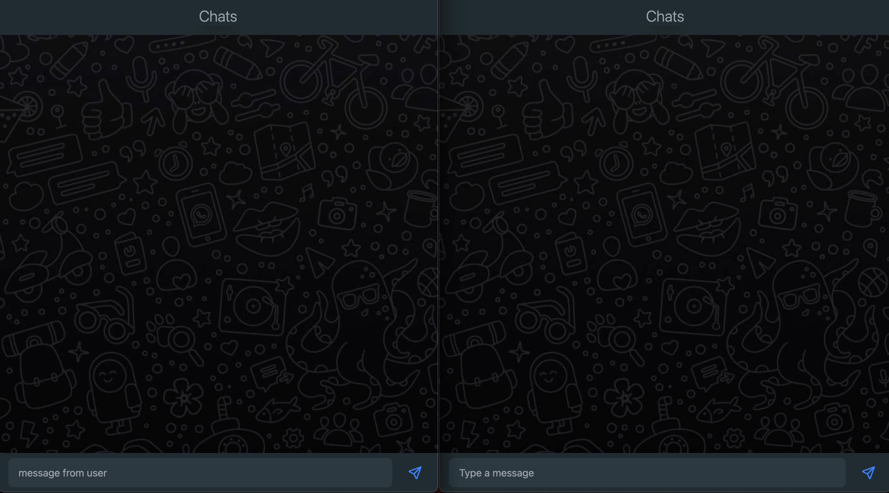

# Websockets



Real time web updates has become a pretty standard feature on modern web apps. Intermitent polling is a common technique and is super simple to implement with Apollo's pollingInterval query attribute. Rather than using this approach, I decided to use WebSockets.


This projcet is a bare bones chat app that uses Apollo subscriptions to implement the real time updates. Apollo uses a publish-subscribe (pub/sub) model to track events that update active subscriptions. The PubSub class implemented in this project is not suitable for production use as it's an in-memory event system that only supports a single server instance. There are many other PubSub libraries that are suitable for production environments and I will definitely be looking into those in the future.

## Technologies used

| Backend | Frontend      |
| ------- | ------------- |
| GraphQL | Next.js       |
| Prisma  | TypeScript    |
| Nexus   | Tailwind      |
| Express | Apollo Client |

## How to run the app locally

1. Clone this repository.

2. Navigate to the web directory and install the required web packages using `yarn`.

3. Open a new terminal, navigate to the web directory, create a `.env` file and add the following variables.

```
DATABASE_URL="postgresql://<username>:<password>@localhost:<prot>/<database-name>?schema=public"
```

4. Install the required server packages using `yarn`.

5. Run the app by using `yarn dev` in the web directory and `yarn dev` in the server directory.
