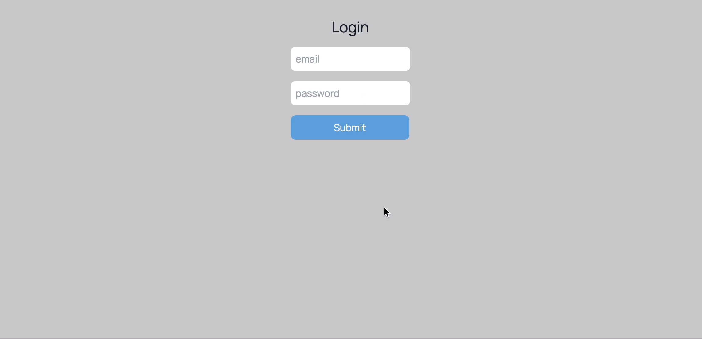

# Stripe Integration



This was a really straightforward project that enables users to register and then put in their credit card details which subsequently uses the Stripe API to create a new customer. Once the customer is successfully created, the stripId field on the user is updated to contain the customer id provided by Stripe. This indicates that the user has successfully made a purchase.

## Technologies used

| Backend | Frontend      |
| ------- | ------------- |
| GraphQL | Next.js       |
| Prisma  | TypeScript    |
| Nexus   | Tailwind      |
| Express | Apollo Client |

## How to run the app locally

1. Create a Stripe account.

2. Clone this repository.

3. Navigate to the web directory and install the required web packages using `yarn`.

4. Create a `.env.local` file in the base of the web directory and add your stripe publishable key value:

```
NEXT_PUBLIC_STRIPE_PUBLISHABLE_KEY=''
```

5. Open a new terminal, navigate to the api directory, create a `.env.local` file and add the following variables.

```
DATABASE_URL="postgresql://<username>:<password>@localhost:<prot>/<database-name>?schema=public"
STRIPE_CLIENT_SECRET=''
```

6. Install the required api packages using `yarn`.

7. Run the app by using `yarn dev` in the web directory and `yarn dev` in the api directory.
