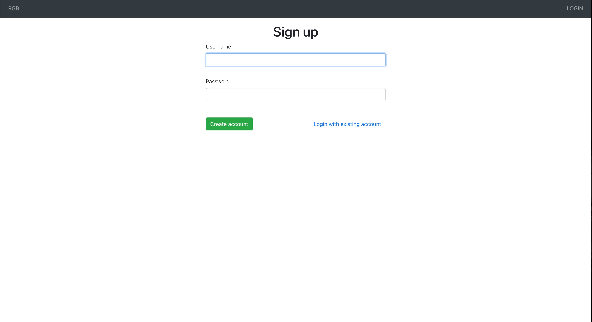

# Golang Gin App



This project was based on [Krajnik's](https://dev.to/matijakrajnik/docker-deploy-1aa7) tutorial. The tutorial goes through the basics of using Gin to build a CRUD web application. The reason I chose to experiment with Gin was due to its reputation as a lightweight and high-performance web framework. The application includes basic user authenitcaion as well as the ability to create, update and delete posts.

## Technologies used

| Golang |
| ------ |
| Gin    |

## How run the app locally

1. Clone this repository.

2. Add a username and password to the `.env` file.

3. Build the docker image

```bash
docker build -t DOCKER_ID/rgb -f docker/Dockerfile .
```

4. Create the necessary containers

```bash
cd docker/
docker-compose up -d
```

5. Run the migrations

```bash
docker-compose run --rm rgb sh
cd migrations/
./migrations init
./migrations up
```

6. Open a new browser window `http://localhost:8080`
