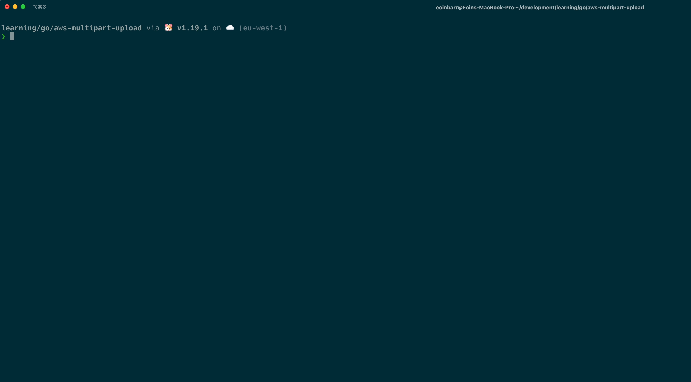

# Golang S3 Multipart Upload

This project was based on [Mathis Van Eetvelde's](https://www.youtube.com/watch?v=fEVRl9MLJC0&ab_channel=MathisVanEetvelde) S3 multipart uplaod. I decided to do this project becuase I had experience implenting S3 multipart uploads using Node.js and I wanted compare the process of building it using Golang.

## Technologies used

| Golang | AWS S3 |
| ------ | ------ |

## How run the app locally

1. Create a new AWS S3 bucket

2. Configure the permissions to enable uploading

3. Ensure the AWS command line has been installed and configured

4. Clone this repository

5. Add in the bucket name, region and file to be uploaded
   x
6. Navigate to the repository in the command line and run `go run main.go`
