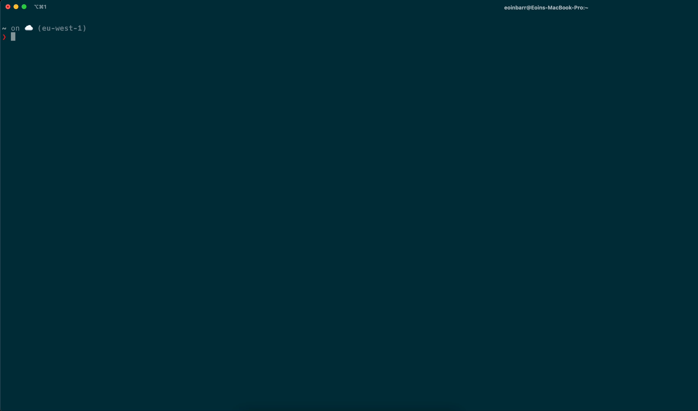

# Golang CLI Tool

This week I built a simple weather api command line tool and published it to Homebrew. This week I used Golang to implement a CLI tool that enables users to enter their city to see the weather as well as flags to get different variations of output. It was also the first time I used goreleaser which turned out to be very straightforward to understand.

## Technologies used

| Golang | goreleaser |
| ------ | ---------- |

## How to use

1. Run `brew tap eoin-barr/eoin-barr`

2. Run `brew install eoin-barr/eoin-barr/weatherme`

3. Enter `weatherme <city-name>` to see the weather in a city (use the `-a` flag for more granular weather details)
