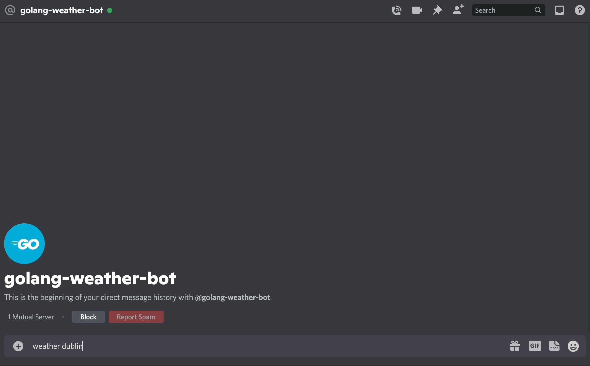

# Golang Discord Weather Bot



This was a really quick project to get try to get familair with the basics of Golang. The project uses the `github.com/bwmarrin/discordgo` import to handle the Discord authentication logic. When the weather keyword is entered along with a valid city name, a request is send to the Open Weather API to get the latitude and longitude for that city. A subsequent request is then sent to get the current weather for that city using these coordinates, which is then sent as a reply in Discord.

## Technologies used

| Golang |
| ------ |

## How to make your own golang discord weather bot

1. Create a Discord app.

2. Create a bot and give it the suitable permission.

3. Clone this repository and enter in your Discord bot token and your OpenWeather API key.

4. Enter the following commands:

```
go mod init golang-bot

go build main.go

go run main.go
```

5. Send a message to your discord bot in the following format: `weather <name-of-city>`
